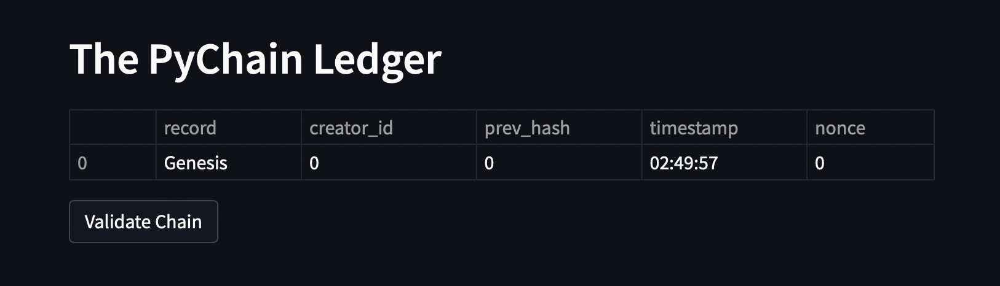
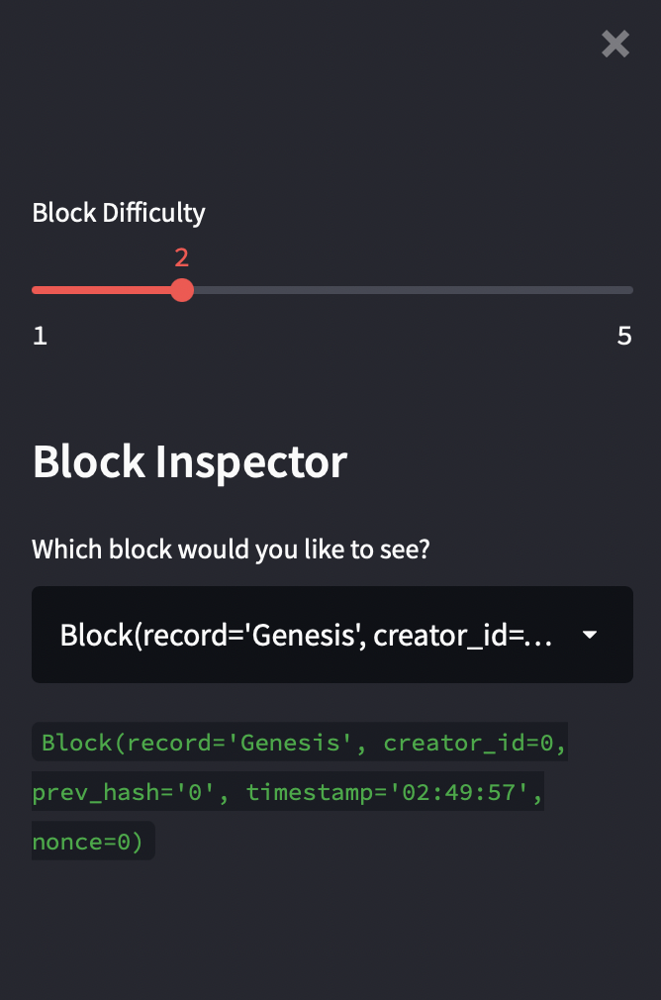
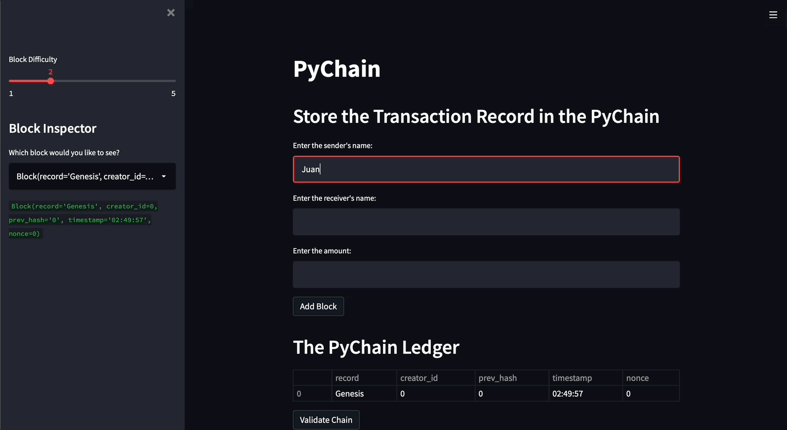

# Blockchain Based Ledger System

---
## Description
This project is a basic implementation of blockchain. Using the application Streamlit we are able to create a web application to follow through the transactions.

---
## Running the Application
Upon running the application:
* A box with a 'sender', 'receiver', and the 'amount' will pop up and the user will have to enter the information in the boxes and later click the 'Add Block'.
  
  

* Below that we have the ledgers, with the 'Validate Chain' button underneath:
  

* To the side we have a slider to change the 'Block Difficulty', and below the 'Block Inspector' to see a specific block.
  

* Here is a gif showing the functionality:
  
  

---

## Contributors
Brought to you by Angel Reyes.